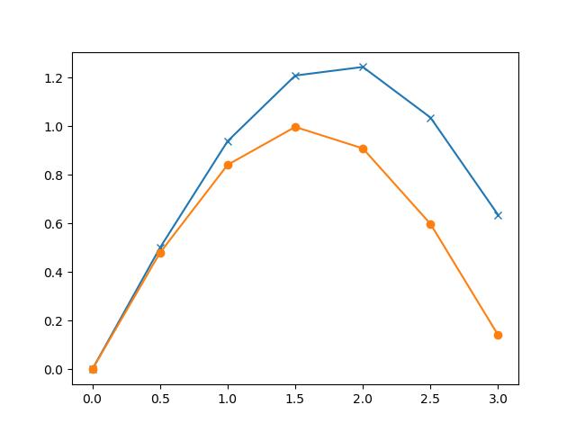
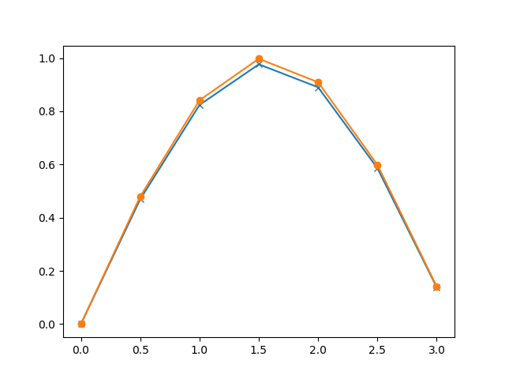
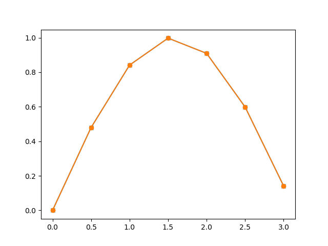
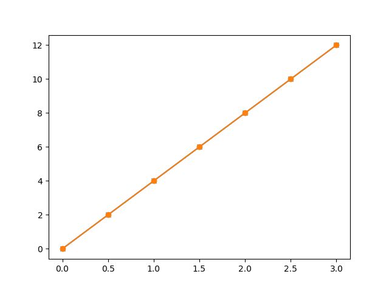

Consider the differential equation,

$\frac{dy}{dx}=f(x,y)$ with an initial value $y(x_0) = y_0$

The derivative of the function and the value of the function at some
initial value are known. The objective is to find out the value of the
function for other values of x, starting from the given initial point.
The underlying idea of any routine for solving the initial value problem
is to rewrite the dy and dx as finite steps $\Delta x$ and $\Delta x$,
to convert the differential equation to an algebraic equation.

$y(x_{i+1}) = y_i + \Delta y  = y_i + \frac{\Delta y}{\Delta x} \times {\Delta x} = y_i + \frac{dy}{dx} \times {\Delta x}$

In the limit of making $\Delta x$ very small, a good approximation to
the underlying differential equation is achieved.


From the figure it can be seen that if the value of the function at  $(x_1,y_1)$ and the slope is known then we can calculate the value of the function at $(x_2,y_2)$. This will give exact result only in the case of a curve with constant slope, a straight line. The equation uses the slope at the starting point and assumes that it is same throught the interval. Euler method is based on that assumption. We will start with Euler method because it is easy to understand and then proceed to more accurate methods.

The procedure can be explained better with some examples. We choose a known function, cos(x), so that the result can be easily cross checked. The Python code does the following:

- define an array $xa$ of the independent variable $x$,using the arange() function.
- calculates it's size and create an empty array $ya$ of same size, to store the results
- fill the initial value of $y$
- $y_{i+1}$ is calculated from $y_{i}$ for each point, using Euler formula.

[euler-sine.py](code/euler-sine.py).

```python
import numpy as np
import matplotlib.pyplot as plt

def f1(x,y):        # derivative of the function to be evaluated
    return np.cos(x)

dx = .5 # step size
xmin = 0    # initial value, where 
xmax = np.pi    # calculate up to this only

xa = np.arange(xmin, xmax, dx)  # array of the independent variable
N =len(xa)

ya = np.empty(N)    # numpy array to store results
ya[0] = 0.0

def euler(x, y, fxy, h):
    return y + h * fxy(x,y)   # Euler method

for i in range(N-1):
    ya[i+1] = euler(xa[i], ya[i], f1, dx)

print (xa[-1], ya[-1],  'Err = ', ya[-1] - np.sin(xa[-1]))   # the last point and error

plt.plot(xa, ya, 'x-')
plt.plot(xa, np.sin(xa), 'o-')
plt.show()
```



The output of the code is shown above. We have deliberately selected a
very large stepsize to show the error. The lower graph, marked with
dots, are the correct values calculated using the sine fnction.
The points marked with crosses are the outputs of the calculation. 
The reason for error is very clear. The Euler method which advances a
solution from $x_i$ to $x_{i+1}$ is not symmetric, it advances the solution
through an interval h, but uses derivative information only at the beginning of that interval.

Better results are obtained if we take trial step to the midpoint of the
interval and use the value of both x and y at that point to compute the
real step across the whole interval. This is called the second-order
Runge-Kutta or the midpoint method. The code remains the same, except for the function euler().
To learn about the theory refer to
[Runge-Kutta methods](http://www.math.iit.edu/~fass/478578_Chapter_3.pdf), [Second
order Runge-Kutta methods]
(http://mathforcollege.com/nm/mws/gen/08ode/mws_gen_ode_txt_runge2nd.pdf)
or any other good books on numerical methods.

[rk2-sine.py](code/euler-sine.py).

```python
import numpy as np
import matplotlib.pyplot as plt

def f1(x,y):        # derivative of the function to be evaluated
    return np.cos(x)

dx = .5 # step size
xmin = 0    # initial value, where 
xmax = np.pi    # calculate up to this only

xa = np.arange(xmin, xmax, dx)  # array of the independent variable
N =len(xa)

ya = np.empty(N)    # numpy array to store results

xa[0] = 0.0 # initial values
ya[0] = 0.0

def rk2(x, y, fxy, h):   # x, y , f(x,y)
    k1 = fxy(x, y)
    k2 = fxy(x + h, h*k1)
    return y + h * ( k1/2 + k2/2)

for i in range(N-1):
    ya[i+1] = rk2(xa[i], ya[i], f1, dx)

print (xa[-1], ya[-1],  'Err = ', ya[-1] - np.sin(xa[-1]))   # the last point and error

plt.plot(xa, ya, 'x-')
plt.plot(xa, np.sin(xa), 'o-')
plt.show()
```



This procedure can be further extended to higher orders. The fourth
order Runge-Kutta method is the most popular one and is commonly
referred as the Runge-Kutta method. In each step the derivative is
evaluated four times as shown in figure below. Once at the initial
point, twice at trial midpoints, and once at a trial endpoint. Every
trial evaluation uses the value of the function from the previous trial
point, ie. $k_2$ is evaluated using $k_1$ and not using $y_i$. From
these derivatives the final function value is calculated.

[rk4-sine.py](code/rk4-sine.py).

```python
import numpy as np
import matplotlib.pyplot as plt

def f1(x,y):        # derivative of the function to be evaluated
    return np.cos(x)

dx = .5 # step size
xmin = 0    # initial value, where 
xmax = np.pi    # calculate up to this only

xa = np.arange(xmin, xmax, dx)  # array of the independent variable
N =len(xa)

ya = np.empty(N)    # numpy array to store results

xa[0] = 0.0 # initial values
ya[0] = 0.0

def rk4(x, y, fxy, h):   # x, y , f(x,y)
    k1 = h * fxy(x, y)
    k2 = h * fxy(x + h/2.0, y+k1/2)
    k3 = h * fxy(x + h/2.0, y+k2/2)
    k4 = h * fxy(x + h, y+k3)
    return  y + ( k1/6 + k2/3 + k3/3 + k4/6 )


for i in range(N-1):
    ya[i+1] = rk4(xa[i], ya[i], f1, dx)

print (xa[-1], ya[-1],  'Err = ', ya[-1] - np.sin(xa[-1]))   # the last point and error

plt.plot(xa, ya, 'x-')
plt.plot(xa, np.sin(xa), 'o-')
plt.show()
```



The reduction is error is clearly visible. We have used very coarse
steps to highlight the error. You may change the value of 'N' in the
code and rerun. Outputs for N=100 are shown below. Also change the code
to remove the marking of points.

[Output of Euler method with 100 points](pics/euler-sine-100N.png)

[Output of Second order Runge-Kutta method with 100 points](pics/rk2-sine-100N.png)

[Output of Fourth order Runge-Kutta method with 100 points](pics/rk4-sine-100N.png)

As we explained earlier, the error is due to the fact that the value of
the derivative changes within the interval but the calculations assume
the derivative at the starting point or obtained by some averaging. This
can be demonstrated by choosing a function representing a straight line,
where derivative is constant, as shown in the example below.

[euler-line.py](code/euler-line.py).

```python
import numpy as np
import matplotlib.pyplot as plt

def f1(x,y):        # derivative of the function to be evaluated
    return 4

dx = .5 # step size
xmin = 0    # initial value, where 
xmax = np.pi    # calculate up to this only

xa = np.arange(xmin, xmax, dx)  # array of the independent variable
N =len(xa)

ya = np.empty(N)    # numpy array to store results

xa[0] = 0.0 # initial values
ya[0] = 0.0

def euler(x, y, fxy, h):
    return y + h * fxy(x,y)   # Euler method

for i in range(N-1):
    ya[i+1] = euler(xa[i], ya[i], f1, dx)

print (xa[-1], ya[-1],  'Err = ', ya[-1] - np.sin(xa[-1]))   # the last point and error

plt.plot(xa, ya, 'x-')
plt.plot(xa, 4*xa, 'o-')
plt.show()
```




