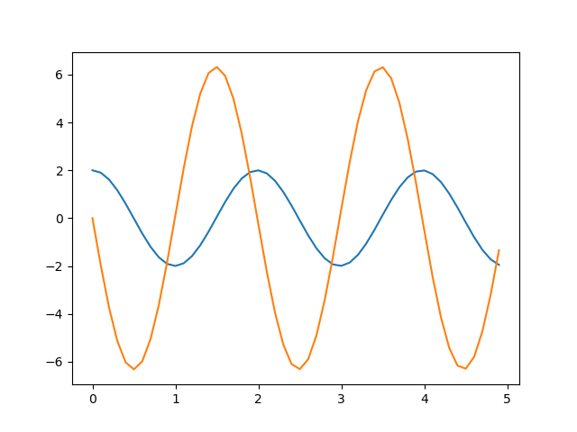

In order to solve a second order differential equation using numerical
methods we need to convert it in to two coupled first order equations,
as shown below.

> $\frac{d^2 x}{dt^2}  = \frac{d}{dt}\Bigg( \frac{dx}{dt} \Bigg) = f(x,t)$
> can be converted in to two coupled equations,
>
> $\frac{dx1}{dt} = f1(x1,x2,t)$ ; $\frac{dx2}{dt} = f2(x1,x2,t)$

Mass and Spring system
----------------------

Let us take the equation for the mass-spring problem equation as an
example. The equation for the mass-spring problem

> $\frac{d^2 x}{dt^2} = -kx^2$

can be written as two coupled equations

> $\frac{dx1}{dt} = x2$
>
> $\frac{dx2}{dt} = -kx1$

Euler method
------------

[ms-euler-1.py](code/ms-euler-1.py).

``` {.sourceCode .python}
k = 10.0    # spring constant
m = 1.0
dt = 0.1
t = 0
x = 2.0     # initial displacement
v = 0.0     # initial velocity

ta = [t]   # list for time, add start time
xa = [x]   # list for displacement, x = 2 at t= 0
va = [v]   # list for velocity, v=0 at t=0

while t < 5:
    f = -k * x
    v =  v + (f/m) * dt   # a = F/m;  a = dv/dt
    x =  x + v * dt         # v = dx/dt
    t = t + dt
    ta.append(t)
    xa.append(x)
    va.append(v)

import matplotlib.pyplot as plt
plt.plot(ta, xa)
plt.plot(ta, va)
plt.show()  
```

{width="400px"}

Displacement and velocity are plotted as a function of time. The
sinusoidal nature of the oscillations are evident from the plot.
However, the way in which the program is written does not show the
connection with our equations explicitly. It will be important when we
move on to other methods like Runge-Kutta, and we re-write the program
as shown below.

[ms-euler-2.py](code/ms-euler-2.py).

``` {.sourceCode .python}
import numpy as np
import matplotlib.pyplot as plt

k = 10.0    # spring constant
m = 1.0
dt = .1
tmax = 5
ta = np.arange(0, tmax, dt)     # array of time
N =len(ta)

def f1(x1,x2,t):        # dx1/dt is x2
    dx1dt = x2
    return dx1dt

def f2(x1,x2,t):
    dx2dt = -k * x1 / m    
    return dx2dt

def euler(x1,x2, f1, f2, t):
    x1 += dt * f1(x1,x2,t)
    x2 += dt * f2(x1,x2,t)
    return x1,x2

x1a = np.zeros(N)       # array to store the computed displacements
x2a = np.zeros(N)       # and velocities
x1 = 2
x2 = 0
x1a[0] = x1             # initial value of displacement
x2a[0] = x2             # and position are filled

for i in range(N-1):
    x1a[i+1], x2a[i+1] = euler(x1a[i], x2a[i], f1, f2, dt)  

plt.plot(ta, x1a)
plt.plot(ta, x2a)
plt.show() 
```

Output of this program will be identical to that of the first one. But
we have added some code to fit the calculated displacement graph using
sine function and extract the frequency. This is compared with the
analytical result f=sqrt(k/m)/2pi. Modify the code to see the effect of
'dt' on the error.

``` {.sourceCode .python}
def sineFunc(x, a1, a2, a3, a4):
    return a4 + a1* np.sin(abs(a2*(2*np.pi))*x + a3)

import scipy.optimize as optimize

fr = np.sqrt(k/m)/2/np.pi
par = [x1a[0], fr, 0.0, 0.0]    # Amp, freq, phase , offset
par, pcov = optimize.curve_fit(sineFunc, ta, x1a, par)
print('Frequencies ', fr, par[1])
```

Runge-Kutta method
------------------

The code can be modified just by replacing the euler function with a one
implementing fourth order Runge-Kutta method.

[ms-rk4.py](code/ms-rk4.py).

The Runge-Kutta function that replaces the Euler funtion is listed
below. The output of the program is also shown.

``` {.sourceCode .python}
def rk4(x1,x2, f1, f2, t):
    k11 = dt*f1(x1,x2,t);
    k21 = dt*f2(x1,x2,t);
    k12 = dt*f1(x1+0.5*k11,x2+0.5*k21,t+0.5*dt);
    k22 = dt*f2(x1+0.5*k11,x2+0.5*k21,t+0.5*dt);
    k13 = dt*f1(x1+0.5*k12,x2+0.5*k22,t+0.5*dt);
    k23 = dt*f2(x1+0.5*k12,x2+0.5*k22,t+0.5*dt);
    k14 = dt*f1(x1+k13,x2+k23,t+dt);
    k24 = dt*f2(x1+k13,x2+k23,t+dt);
    x1 += (k11+2*k12+2*k13+k14)/6;
    x2 += (k21+2*k22+2*k23+k24)/6;
    return x1,x2
```

{width="400px"}
