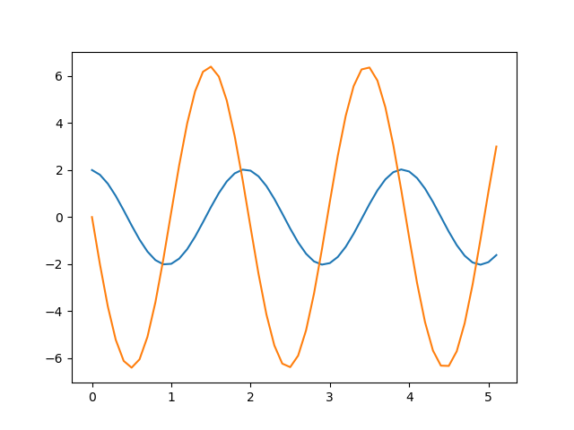

The mass and spring problem is defined by the equation

$\frac{d^{2}y}{dx^{2}}=-kx$

The code listed below solves this problem using Euler's method of integration and plots the position and velocity as a function of time. It does not use Numpy.

